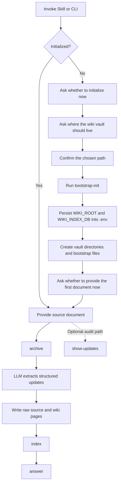

# LLM Wiki Generator

An LLM-first document ingestion and retrieval workflow for building a structured, local, Obsidian-compatible LLM Wiki.

LLM Wiki Generator turns raw source files into traceable wiki knowledge through a direct pipeline: `archive -> answer`.
For audit-heavy workflows, you can still inspect proposed updates with `show-updates` before writing.

## Why This Exists

Most document-driven knowledge workflows break down in one of two ways:

- raw files remain unstructured and difficult to reuse
- LLM-based ingestion writes opaque knowledge that is hard to recall later

This project takes a structured path.

Instead of treating source files as a chat substrate, it treats them as inputs to an LLM-backed knowledge compiler:

1. convert source material into normalized text
2. use an LLM to extract structured wiki updates
3. write knowledge directly into a vault
4. rebuild the retrieval index for immediate recall

The goal is not just answering questions.
The goal is building a knowledge base that can keep evolving and remain searchable.

## Quick Navigation

- [Docs Navigation](#docs-navigation)
- [Workflow](#workflow)
- [First-Time Path](#first-time-path)
- [Quick Start](#quick-start)
- [Example Commands](#example-commands)
- [Vault Structure](#vault-structure)
- [Source Types](#source-types-and-boundaries)

## Docs Navigation

- [Chinese Overview](docs/README.zh-home.md)
- [Chinese Usage Guide](docs/README.zh-usage.md)
- [English Usage Guide](docs/README.en-usage.md)
- [Docs Index](docs/index.md)

## Workflow



## First-Time Path

For a first-time user, the shortest useful path is:

1. install the skill or Python dependencies
2. run `bootstrap-status`
3. run `bootstrap-init` if the workspace is not initialized
4. provide the first source document
5. run `archive` to let the LLM extract and write knowledge directly
6. start querying the indexed wiki

If you already know the desired vault location, you can still configure `.env` first and call `init` directly.
Archive, preview, and apply require a configured OpenAI-compatible LLM; the no-model fallback is only used for answer extraction.

## Properties

- Supports `PDF`, `DOCX`, `PPTX`, `XLSX`, and `TXT`
- Uses an LLM-first direct archive flow
- Requires LLM-backed extraction for document uploads
- Rebuilds the retrieval index by default after direct archive
- Writes into an Obsidian-compatible vault layout
- Keeps raw sources and structured knowledge separate
- Builds a local SQLite retrieval index
- Supports stable and draft knowledge scopes
- Provides bootstrap-style initialization for first-time setup
- Persists chosen vault paths into `.env`

## Quick Start

### Option A: Skill-first workflow

If your host environment supports skill installation:

```bash
npx install skill llm-wiki-generator
```

Check whether the workspace has already been initialized:

```bash
python scripts/cli.py bootstrap-status --as-json
```

If not initialized, create the vault at the chosen path:

```bash
python scripts/cli.py bootstrap-init path/to/wiki-vault
```

Once initialized, continue directly into document ingestion.

### Option B: Manual CLI workflow

Install dependencies:

```bash
pip install -r requirements.txt
```

Create the environment file:

```bash
cp .env.example .env
```

Then either inspect bootstrap status:

```bash
python scripts/cli.py bootstrap-status --as-json
```

Or initialize directly if the vault path is already configured:

```bash
python scripts/cli.py init
```

## Example Commands

Convert a file:

```bash
python scripts/cli.py convert path/to/file.pdf
```

Directly archive a document and rebuild the retrieval index:

```bash
python scripts/cli.py archive path/to/file.docx --source-type team_history
```

Optionally preview archive updates without writing:

```bash
python scripts/cli.py show-updates path/to/file.docx --source-type team_history
```

Write without rebuilding the index:

```bash
python scripts/cli.py archive path/to/file.docx --source-type team_history --no-index
```

Build the retrieval index:

```bash
python scripts/cli.py index
```

Query the wiki:

```bash
python scripts/cli.py answer "What business constraints are currently known?"
```

Include draft knowledge:

```bash
python scripts/cli.py answer "What design ideas were mentioned in team history?" --scope stable-draft
```

## Vault Structure

A typical initialized workspace looks like this:

```text
10-raw/
  business_fact/
  industry_practice/
  team_history/
  feedback/

20-wiki/
  sources/
  entities/
  concepts/
  synthesis/
  conflicts/
  prd-patterns/
  index.md
  log.md

index.sqlite3
```

## Source Types and Boundaries

Supported `source_type` values:

- `business_fact`
- `industry_practice`
- `team_history`
- `feedback`

Behavior rules:

- `business_fact` may become stable business knowledge when evidence is strong
- `industry_practice` may become patterns or synthesis, but not customer truth
- `team_history` may also produce PRD patterns from historical PRDs and team decisions, but remains `draft`
- `feedback` defaults to `draft`
- conflicts never overwrite older knowledge; they go into `20-wiki/conflicts/`

## Design Intent

This repository prefers explicit state transitions over opaque ingestion.

Key design choices:

- direct LLM-backed archive by default
- deterministic archive application
- persistent raw source capture
- local retrieval over archived markdown
- required LLM usage for archive extraction, with extractive fallback reserved for answering

The result is closer to a small knowledge compiler than a chat wrapper around files.

## Who This Is For

- developers building agent-oriented knowledge workflows
- teams that need local, inspectable, versionable knowledge artifacts
- users who want a stricter alternative to direct document chat
- individuals maintaining a structured personal wiki knowledge base

## Tech Stack

- Python
- Typer
- Rich
- Pydantic
- SQLite FTS
- OpenAI-compatible API
- document parsers for DOCX, PPTX, XLSX, and PDF

## Learn More

Detailed usage guides live in [`docs/`](docs/).
