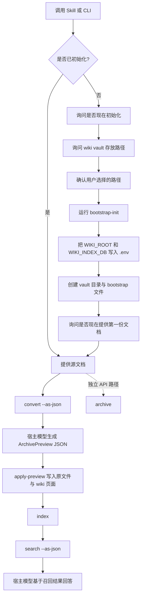

# LLM Wiki Generator

一个以宿主模型归档与本地检索为核心的文档归档工作流，用来构建结构化、本地化、兼容 Obsidian 的 LLM Wiki。

LLM Wiki Generator 通过一条 host-model 流水线把原始文件转成可追溯的 wiki 知识：`convert -> host model -> apply-preview -> search -> host answer`。
安装为 skill 后，Claude Code、Codex、OpenCode 可以使用自身模型完成归档抽取和回答综合；Python CLI 只负责确定性的转换、校验、写入、索引和检索。

[Back to README](../README.md) | [Docs Index](index.md) | [中文使用说明](README.zh-usage.md)

## 为什么做这个项目

很多基于文档的知识流程最后都会卡在两类问题上：

- 原始文件一直是原始文件，难以结构化复用
- LLM 归档写成了不可追踪的临时回答，后续很难召回

这个项目选择了更结构化的一条路。

它不把源文件当作聊天上下文，而是把它们当作 LLM-backed knowledge compiler 的输入：

1. 先把源资料转换成规范化文本
2. 让宿主模型抽取结构化 wiki 更新
3. 让 CLI 校验并把知识写入 vault
4. 最后在结果上建立检索索引

目标不只是“能回答问题”。
更重要的是让知识库可以持续演化，同时保持可检索、可追溯。

## 快速导航

- [文档导航](#文档导航)
- [工作流](#工作流)
- [首次使用路径](#首次使用路径)
- [快速开始](#快速开始)
- [示例命令](#示例命令)
- [Vault 结构](#vault-结构)
- [来源类型与边界](#来源类型与边界)

## 文档导航

- [项目首页 README](../README.md)
- [中文使用说明](README.zh-usage.md)
- [English Usage Guide](README.en-usage.md)
- [Docs Index](index.md)

## 工作流



## 首次使用路径

如果你是第一次使用，这条路径最顺手：

1. 先安装 skill 或 Python 依赖
2. 运行 `bootstrap-status`
3. 如果还没初始化，就运行 `bootstrap-init`
4. 提供第一份源文档
5. 执行 `convert --as-json`
6. 让宿主模型生成 `ArchivePreview` JSON，并用 `apply-preview` 写入
7. 用 `search --as-json` 召回，再让宿主模型回答

如果你已经明确知道 vault 路径，也可以先配好 `.env`，然后直接调用 `init`。
宿主模型 skill 模式不需要 `LLM_API_KEY`；独立 CLI/API 模式仍可通过 `.env` 配置 OpenAI-compatible API。

## 核心特性

- 支持 `PDF`、`DOCX`、`PPTX`、`XLSX`、`TXT`、`MD`、`Markdown`
- 安装为 skill 后默认使用 Claude Code、Codex、OpenCode 的宿主模型做归档和回答
- 提供确定性 CLI 工具负责转换、写入、索引、检索
- 直接归档后默认重建检索索引
- 输出为兼容 Obsidian 的 vault 结构
- 原始文件与结构化知识分层保存
- 本地 SQLite 检索索引
- 支持 `stable` 与 `draft` 两种知识范围
- 首次使用支持 bootstrap 式初始化
- 用户确认的 vault 路径会持久化写入 `.env`

## 快速开始

### 方案 A：Skill 优先

如果宿主环境支持 skill 安装：

```bash
npx install skill llm-wiki-generator
```

先检查当前工作区是否已经初始化：

```bash
python scripts/cli.py bootstrap-status --as-json
```

如果尚未初始化，就在用户确认后的路径上创建 vault：

```bash
python scripts/cli.py bootstrap-init path/to/wiki-vault
```

初始化完成后，就可以继续导入第一份文档。

### 方案 B：手动 CLI

安装依赖：

```bash
pip install -r requirements.txt
```

创建环境文件：

```bash
cp .env.example .env
```

然后执行以下两种方式之一：

检查当前初始化状态：

```bash
python scripts/cli.py bootstrap-status --as-json
```

或者在路径已经配置好的前提下直接初始化：

```bash
python scripts/cli.py init
```

## 示例命令

转换单个文件：

```bash
python scripts/cli.py convert path/to/file.pdf
```

宿主模型归档流程：

```bash
python scripts/cli.py convert path/to/file.docx --as-json
```

宿主模型生成 `ArchivePreview` JSON 后：

```bash
python scripts/cli.py apply-preview path/to/file.docx --preview-file /tmp/archive-preview.json
```

宿主模型召回流程：

```bash
python scripts/cli.py search "当前有哪些已确认的业务约束？" --scope stable-draft --as-json
```

构建检索索引：

```bash
python scripts/cli.py index
```

独立 CLI/API 归档：

```bash
python scripts/cli.py archive path/to/file.docx --source-type team_history
```

独立 CLI 问答：

```bash
python scripts/cli.py answer "团队历史里提到过哪些设计思路？" --scope stable-draft
```

## Vault 结构

一个典型的初始化结果如下：

```text
10-raw/
  business_fact/
  industry_practice/
  team_history/
  feedback/

20-wiki/
  sources/
  entities/
  concepts/
  synthesis/
  conflicts/
  prd-patterns/
  index.md
  log.md

index.sqlite3
```

## 来源类型与边界

支持的 `source_type`：

- `business_fact`
- `industry_practice`
- `team_history`
- `feedback`

基本规则：

- `business_fact` 在证据足够强时可进入稳定业务知识
- `industry_practice` 可形成 pattern 或 synthesis，但不应被当作客户事实
- `team_history` 也可以从历史 PRD 和团队决策中提取 PRD pattern，但仍默认进入 `draft`
- `feedback` 默认进入 `draft`
- 冲突内容不会覆盖旧知识，而是写入 `20-wiki/conflicts/`

## 设计意图

这个仓库更偏向显式状态流转，而不是黑盒式归档。

核心设计选择包括：

- skill 模式默认使用宿主模型归档和回答
- deterministic archive application
- 持久保存原始文件
- 对归档后的 markdown 做本地检索
- 独立 CLI 模式仍支持 OpenAI-compatible API

最终效果更像一个小型 knowledge compiler，而不是简单包了一层文档聊天。

## 适合谁使用

- 正在构建 agent 知识工作流的开发者
- 需要本地、可检查、可版本化知识产物的团队
- 想要一种比直接文档问答更严格流程的使用者
- 正在维护个人结构化知识库的人

## 技术栈

- Python
- Typer
- Rich
- Pydantic
- SQLite FTS
- 宿主模型 skill 模式，以及可选 OpenAI-compatible API 模式
- DOCX / PPTX / XLSX / PDF 文档解析库

说明：当前没有集成 MarkItDown。Markdown 文件通过 `.md` 和 `.markdown` 原样读取。

## 延伸阅读

更详细的使用说明见 [`docs/`](./)。
