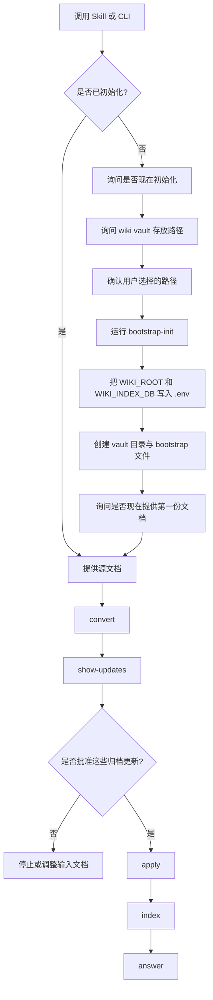

# LLM Wiki Generator

一个以预览为先的文档归档与检索工作流，用来构建结构化、本地化、兼容 Obsidian 的 LLM Wiki。

LLM Wiki Generator 通过一条显式流水线把原始文件转成可追溯的 wiki 知识：`convert -> show-updates -> apply -> index -> answer`。
它适合 agent 工作流、本地知识系统，以及独立 CLI 场景，尤其适合那些更在意可审阅性和可控性，而不是直接“对着文件聊天”的使用方式。

[Back to README](../README.md) | [Docs Index](index.md) | [中文使用说明](README.zh-usage.md)

## 为什么做这个项目

很多基于文档的知识流程最后都会卡在两类问题上：

- 原始文件一直是原始文件，难以结构化复用
- LLM 归档过早写入、写得过多、缺少中间审阅环节

这个项目选择了更严格的一条路。

它不把源文件当作聊天上下文，而是把它们当作一条分阶段知识流水线的输入：

1. 先把源资料转换成规范化文本
2. 再生成拟议的 wiki 更新
3. 让用户先审阅这些更新
4. 只把确认后的知识写入 vault
5. 最后在结果上建立检索索引

目标不只是“能回答问题”。
更重要的是让知识库可以持续演化，同时仍然保持可解释、可检查、可追溯。

## 快速导航

- [文档导航](#文档导航)
- [工作流](#工作流)
- [快速开始](#快速开始)
- [示例命令](#示例命令)
- [Vault 结构](#vault-结构)
- [来源类型与边界](#来源类型与边界)

## 文档导航

- [项目首页 README](../README.md)
- [中文使用说明](README.zh-usage.md)
- [English Usage Guide](README.en-usage.md)
- [Docs Index](index.md)

## 工作流



## 核心特性

- 支持 `PDF`、`DOCX`、`PPTX`、`XLSX`、`TXT`
- 采用 preview-before-write 的归档方式
- 输出为兼容 Obsidian 的 vault 结构
- 原始文件与结构化知识分层保存
- 本地 SQLite 检索索引
- 支持 `stable` 与 `draft` 两种知识范围
- 首次使用支持 bootstrap 式初始化
- 用户确认的 vault 路径会持久化写入 `.env`

## 快速开始

### 方案 A：Skill 优先

如果宿主环境支持 skill 安装：

```bash
npx install skill llm-wiki-generator
```

先检查当前工作区是否已经初始化：

```bash
python scripts/cli.py bootstrap-status --as-json
```

如果尚未初始化，就在用户确认后的路径上创建 vault：

```bash
python scripts/cli.py bootstrap-init path/to/wiki-vault
```

初始化完成后，就可以继续导入第一份文档。

### 方案 B：手动 CLI

安装依赖：

```bash
pip install -r requirements.txt
```

创建环境文件：

```bash
cp .env.example .env
```

然后执行以下两种方式之一：

检查当前初始化状态：

```bash
python scripts/cli.py bootstrap-status --as-json
```

或者在路径已经配置好的前提下直接初始化：

```bash
python scripts/cli.py init
```

## 示例命令

转换单个文件：

```bash
python scripts/cli.py convert path/to/file.pdf
```

预览归档更新：

```bash
python scripts/cli.py show-updates path/to/file.docx --source-type team_history
```

应用归档更新：

```bash
python scripts/cli.py apply path/to/file.docx --source-type team_history
```

构建检索索引：

```bash
python scripts/cli.py index
```

从 wiki 中提问：

```bash
python scripts/cli.py answer "当前有哪些已确认的业务约束？"
```

包含草稿知识一起检索：

```bash
python scripts/cli.py answer "团队历史里提到过哪些设计思路？" --scope stable-draft
```

## Vault 结构

一个典型的初始化结果如下：

```text
10-raw/
  business_fact/
  industry_practice/
  team_history/
  feedback/

20-wiki/
  sources/
  entities/
  concepts/
  synthesis/
  conflicts/
  prd-patterns/
  index.md
  log.md

index.sqlite3
```

## 来源类型与边界

支持的 `source_type`：

- `business_fact`
- `industry_practice`
- `team_history`
- `feedback`

基本规则：

- `business_fact` 在证据足够强时可进入稳定业务知识
- `industry_practice` 可形成 pattern 或 synthesis，但不应被当作客户事实
- `team_history` 默认进入 `draft`
- `feedback` 默认进入 `draft`
- 冲突内容不会覆盖旧知识，而是写入 `20-wiki/conflicts/`

## 设计意图

这个仓库更偏向显式状态流转，而不是黑盒式归档。

核心设计选择包括：

- preview before write
- deterministic archive application
- 持久保存原始文件
- 对归档后的 markdown 做本地检索
- LLM 可配置，但无模型时也能退回到可用的 fallback

最终效果更像一个小型 knowledge compiler，而不是简单包了一层文档聊天。

## 适合谁使用

- 正在构建 agent 知识工作流的开发者
- 需要本地、可检查、可版本化知识产物的团队
- 想要一种比直接文档问答更严格流程的使用者
- 正在维护个人结构化知识库的人

## 技术栈

- Python
- Typer
- Rich
- Pydantic
- SQLite FTS
- OpenAI-compatible API
- DOCX / PPTX / XLSX / PDF 文档解析库

## 延伸阅读

更详细的使用说明见 [`docs/`](./)。
